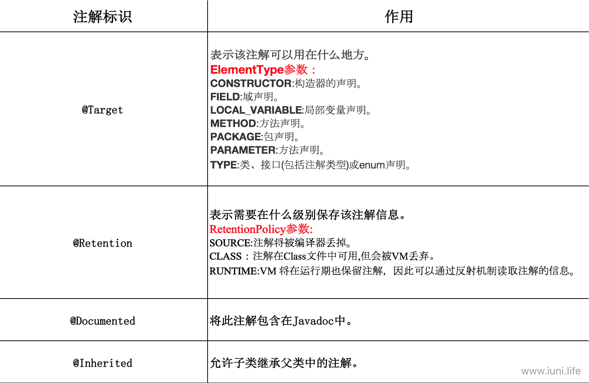
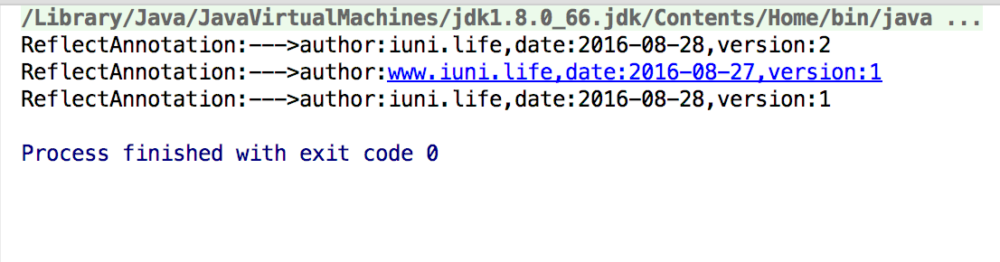

**摘要：**

本篇主要内容有：Java注解的介绍、基本语法、反射方式实现注解处理器。

<!--more-->

# 前言

​	正所谓只要功夫深，铁杵磨成针，坚持不懈，水滴石穿。学习也要坚持不懈，慢慢积累，才能达到以量变促成质变。在前进的过程中也要保持好良好的心态，不急不燥，脚踏实地，一步一个脚印。

# 注解的介绍

​	注解也被称为元数据，是Java SE5引入的重要的语言变化一，注解的出现为我们在代码中添加信息提供来了一种形式化的方法，使我们可以在稍后的某个时刻方便的使用这些数据。

# 注解的作用

- 生成描述符文件。
- 新的类定义。
- 减轻编写“样板”代码的负担。
- 使代码干净易读。
- 可以在编译期进行类型检查。
- 。。。。。。

# 标准注解

​	Java为我们提供了三种标准化的注解，见以下表格：

| 注解标识              | 作用                                       |
| :---------------- | :--------------------------------------- |
| @Override         | 表示当前的方法定义覆盖超类中的方法，如果一不小心拼写错误，或者签名方法对不上被覆盖的方法，编译器就会发生错误。 |
| @Deprecated       | 如果使用了注解为它的元素，编译器会发出警告信息                  |
| @SuppressWarnings | 关闭不当的编译器警告信息                             |

# 注解的基本语法

定义一个Test注解：

```java
package iuni.life;

import java.lang.annotation.ElementType;
import java.lang.annotation.Retention;
import java.lang.annotation.RetentionPolicy;
import java.lang.annotation.Target;

/**
 * Created by  iuni.life on 16/8/29.
 * yangfei's computer
 */
@Target(ElementType.METHOD)
@Retention(RetentionPolicy.RUNTIME)
public @interface Test {
}
```

​	可以看到注解的定义和接口的定义非常相似，事实上，与其他任何Java接口一样，注解也会编译成class文件。注解和接口最明显的区别是在@符号上，即注解定义时为@interface，接口为interface。

​	除了@符号外，定义的Test注解更像是一个空的接口。当我们定义一个注解的时候会需要一些元注解，如@Target和@Retention。其实在Java目前内置了三种**标准注解**（详见前面表格）和四种**元注解**。元注解专职负责注解其他的注解，以下是四种元注解的介绍：

 

​	在注解中一般都会包含一些元素以表示某些值，当分析处理注解时，程序或者工具可以利用这些值。注解的元素看起来就像接口的方法，唯一的区别就是你可以为其指定默认值。

​	没有元素的注解称为**标记注解** ，上例定义的Test注解就是标记注解。

​	在Java中实现注解一般是按照以下步骤：定义注解—>实现注解处理器—>使用注解。注解处理器的实现方式分为两种，一种是用反射的方式实现，另一种则是使用apt工具实现，下面我们通过例子来学习这两种实现方式。

# 编写注解处理器

## 准备工作

​	在编写注解处理器之前我们需要知道注解的一些规则；

1. **注解可以使用的元素**

   - 所有基本类型（int、float、boolean等）。
   - String
   - Class
   - enum
   - Annotation
   - 以上类型的数组

2. **默认值限制**

   编译器对元素的默认值有些过分挑剔，首先**元素不能有不确定的值**，即元素必须要么有默认值，要么在使用注解的时候提供元素的值。

   其次，对于非基本类型的元素，无论是在源码声明时，或者是在注解接口中定义默认值时，都不能用null作为其值。这个约束使得处理器很难表现一个元素的存在或者缺失的状态，因为在每个注解的声明中，所有的元素都存在并且具有相应的值，那么我们怎么样表现元素的存在或缺失状态呢？我们可以定义一些特殊值，例如空字符串或者负数，用以表示某个元素不存在。

3. **注解不支持继承**

   不能使用关键字extends来继承某个@interface。

4. **注解的方法不能有参数**

## 使用反射方式实现

1. 定义一个ReflectAnnotation注解:

   ```java
   package iuni.life;

   import java.lang.annotation.ElementType;
   import java.lang.annotation.Retention;
   import java.lang.annotation.RetentionPolicy;
   import java.lang.annotation.Target;

   /**
   * Created by  iuni.life on 16/8/29.
   * yangfei's computer
   */
   @Target(ElementType.METHOD)
   @Retention(RetentionPolicy.RUNTIME)
   public @interface ReflectAnnotation {
      String author() default "iuni.life";

      String date();

      int version() default 1;
     
   }
   ```

2. 使用反射的方式实现注解处理器：

   ```java
          package iuni.life;

             import java.lang.reflect.Method;

             /**
   * Created by  iuni.life on 16/8/29.
   * yangfei's computer
   */
   public class ReflecAnnotationTracker {
          public static void trackerReflectAnnotation(Class<?> cl) {
              //getDeclaredMethods 反射方法,获取cl类中所有的方法
              for (Method method : cl.getDeclaredMethods()) {
                  //getAnnotation()方法返回指定的类型的注解对象,这里就是ReflectAnnotation.class,如果没有该类型的注解则返回null
                  ReflectAnnotation reflectAnnotation = method.getAnnotation(ReflectAnnotation.class);
                  if (reflectAnnotation != null) {
                      sys("ReflectAnnotation:--->author:" + reflectAnnotation.author() + ",date:" + reflectAnnotation.date() + ",version:" + reflectAnnotation.version());
                  }
              }
          }

          public static void sys(String detail) {
              System.out.println(detail);
          }
      }
   ```

   ​

3. 测试类：

   ```java 
       package iuni.life;

       import java.text.SimpleDateFormat;
       import java.util.Date;

       /**
   * Created by  iuni.life on 16/8/29.
   * yangfei's computer
   */
   public class Client {
      public static void main(String[] args) {
          ReflecAnnotationTracker.trackerReflectAnnotation(Client.class);
      }

      @ReflectAnnotation(author = "www.iuni.life", date = "2016-08-27", version = 1)
      public void allTest() {
      }

      //因为author提供了默认值所以这里可以不使用
      @ReflectAnnotation(date = "2016-08-28", version = 2)
      protected void test1() {
      }

      //因为author、version提供了默认值所以这里可以不使用  因为Date没有提供默认值,所以必须对date进行赋值
      @ReflectAnnotation(date = "2016-08-28")
      private void test2() {
      }
     
     
        }
   ```

4. 运行Client类的结果：

   

**说明：**

​	使用反射方式实现注解处理器最好还是了解一下Java反射方面的知识，这里列举的例子只是最简单的形式，只是起到了我们怎么使用反射的方式实现Java注解处理器的作用。	


因篇幅原因，apt实现注解处理器详见 [Java注解二](https://github.com/OriginalLove/JavaAdvanced/blob/master/Java%E6%B3%A8%E8%A7%A3%E4%BA%8C.md)。


# 后记

文章有不足之后，请大家多多指教，共同学习，共同进步。


