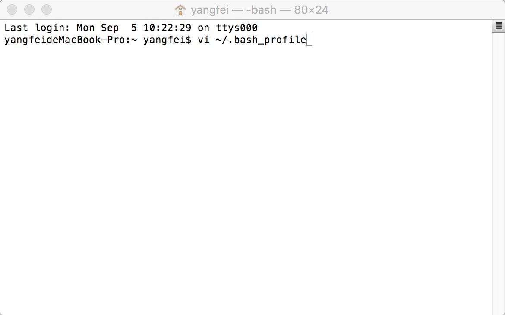
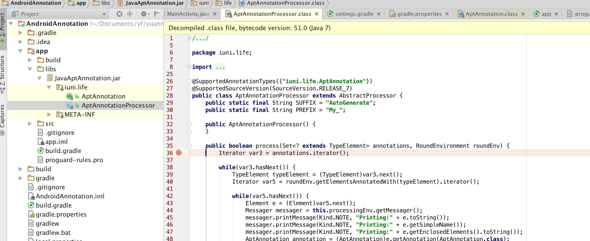

**摘要:**

​	本篇主要是讲使用Android Studio 对apt实现Java注解处理器进行Debug。
​	
<!--more-->

# 前言

​	通过前两篇文章对Java注解有了一定的了解并可以实现简单的应用，因为对使用反射的方式实现注解处理器进行Debug和正常的调试没有太大的区别，所以在这里就不做详细的介绍了。现在就来了解一下Android Studio如何对apt实现Java注解处理器进行Debug。

**注意:**

​	本篇是对[Java注解二](http://iuni.life/2016/08/30/Java%E6%B3%A8%E8%A7%A3%E4%BA%8C/) 中的实例进行调试。

## 准备工作

​	把Android Studio中带的gradle添加到电脑的环境变量中，因我使用的是Mac 所以这里只写了Mac下gradle环境变量的配置，配置方法如下：

1. 在mac下打开终端，输入 vi ~/.bash_profile ，如下图所示:

   

2. 按Enter键进入环境变量配置，按字母"i"进入编译状态，输入下面文字：

   ```java
   //这里找自己电脑上的Android Studio中下面的gradle路径及版本(获取方法详见下面注意) 注意Android studio中因为有空格所以要使用转义符\  转移符必不可少。
   export GRADLE_HOME=/Applications/Android\ Studio.app/Contents/gradle/gradle-2.14.1

   export PATH=${PATH}:${GRADLE_HOME}/bin
   ```

   配置好后如下图：

   

3. 配置好后，按Esc键退出编辑，然后输入":wq!"退出并保存修改的文件。

4. 关闭终端，并且重启，配置完成

**注意：**

* **配置环境变量可能带来的问题**

  1. 配置出错，命令无法使用可以使用以下命令搞定：
     export PATH=/usr/local/sbin:/usr/local/bin:/sbin:/bin:/usr/sbin:/usr/bin:/root/bin

     输入以上命令，然后进入配置文件，检查配置文件把配错的路径更正即可。

* **查询Android studio中gradle的路径**

  在Mac中通过Finder打开应用程序界面，找到Android Studio.app右击选择显示包内容，然后依次按照Contents/gradle/  路径打开，即可发现自己Android Studio中的gradle的版本，把找到的路径配置到环境变量即可，我这里的是gradle-2.14.1。

## 设置断点

​	在process方法下打断点，如图：



## 配置gradle

设置grade daemon端口和JVM参数，把下面的代码加入到gradle.properties中，代码为：

```java
org.gradle.daemon=true
org.gradle.jvmargs=-agentlib:jdwp=transport=dt_socket,server=y,suspend=n,address=5005
```

加好后，gradle.properties文件里的内容如下图所示：


配置好后，打开Android studio的Terminal,输入以下命令启动守护线程:

```java
gradle --daemon
```

如下图所示:


按Enter等待相关文件下载完成。成功之后应该会出现BUILD SUCCESSFUL。


## 建立Remote Debugger

如下图所示流程：


其他我们保持默认即可。

## 调试

1. 选择刚新建的AptAnnotationProcessor,如下图所示：

   

2. 点击图标 执行Debug，然后依次执行Clean Project ，Make Project 即可进入调试。


下一篇会列举一个Java注解的应用的实例。

# 后记

文章有不足之后，请大家多多指教，共同学习，共同进步。