**摘要:**

​	本篇将会介绍使用apt工具实现注解处理器。

<!--more-->

[TOC]

# 使用apt工具实现Java注解处理器

**使用之前，请确认JAVA的环境变量已经配置成功，并且把tools.jar加入到自己电脑的环境变量中**，在这里我使用的是IntelliJ IDEA (开发注解以及解析库，并且打出jar包)和Android studio(测试自己打出的jar包的使用情况)，使用apt实现的注解处理器是编译时处理注解。

使用apt处理注解关键是继承**AbstractProcessor**，实现**process**方法。

下面就让我们一步一步的实现一个简单的例子：

1.    **首先，创建一个Maven支持的Java标准工程，新建过程按照下图所示顺序：**

       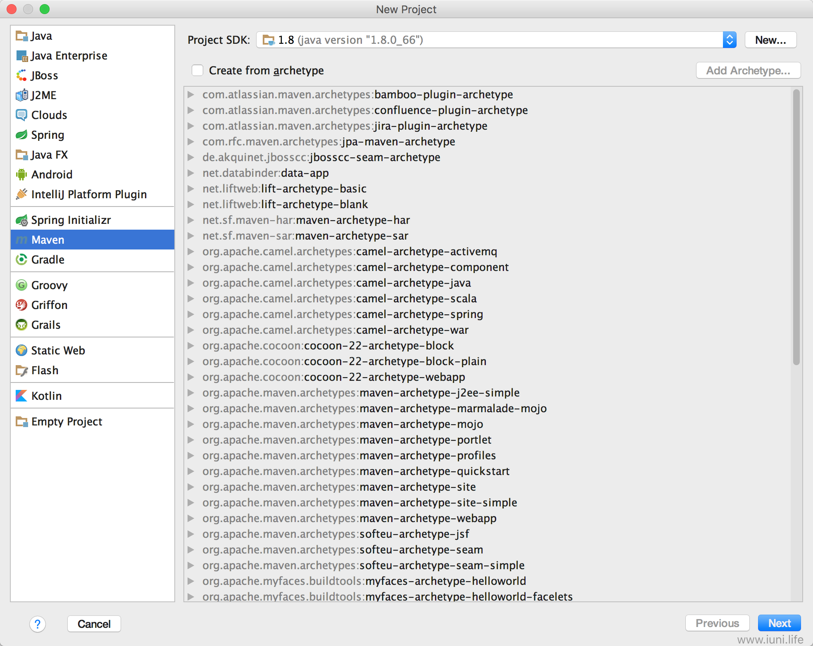

       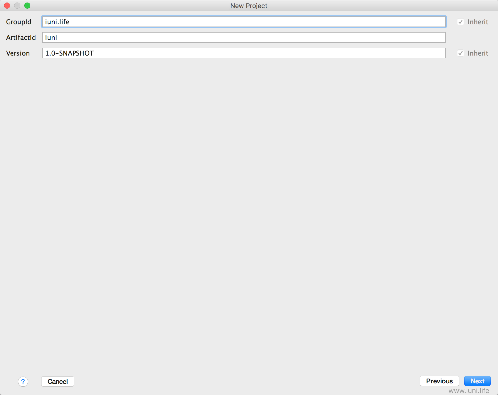

       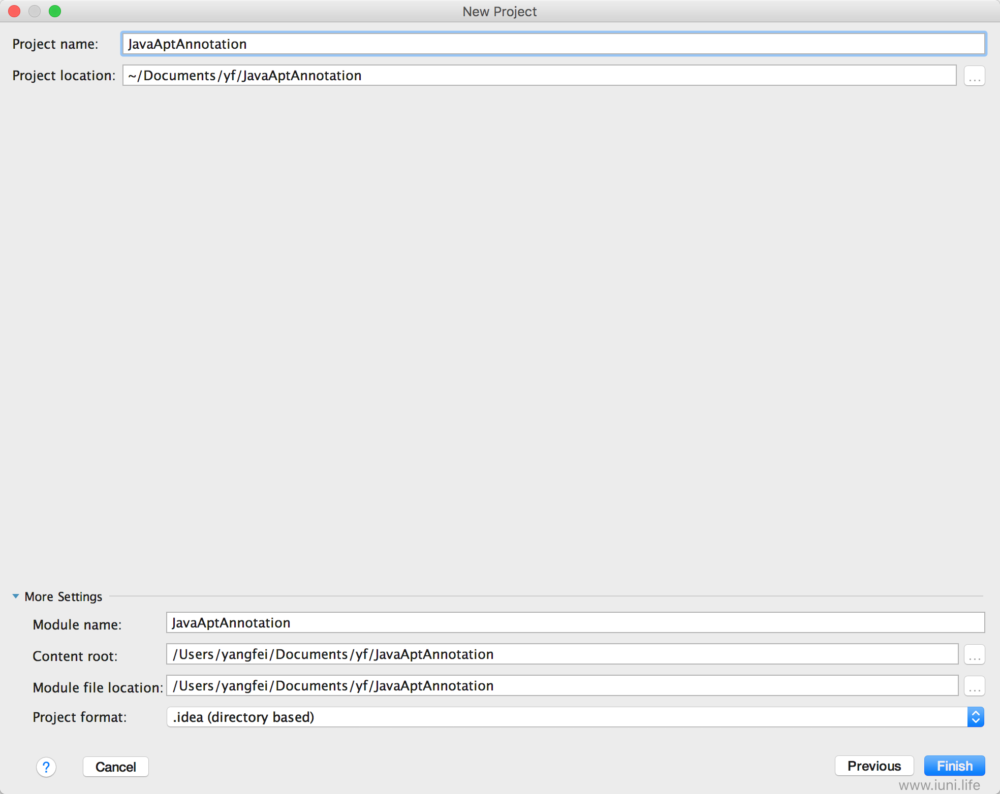

      新建好工程之后，我又创建了一个包，下图是目前的项目目录：

       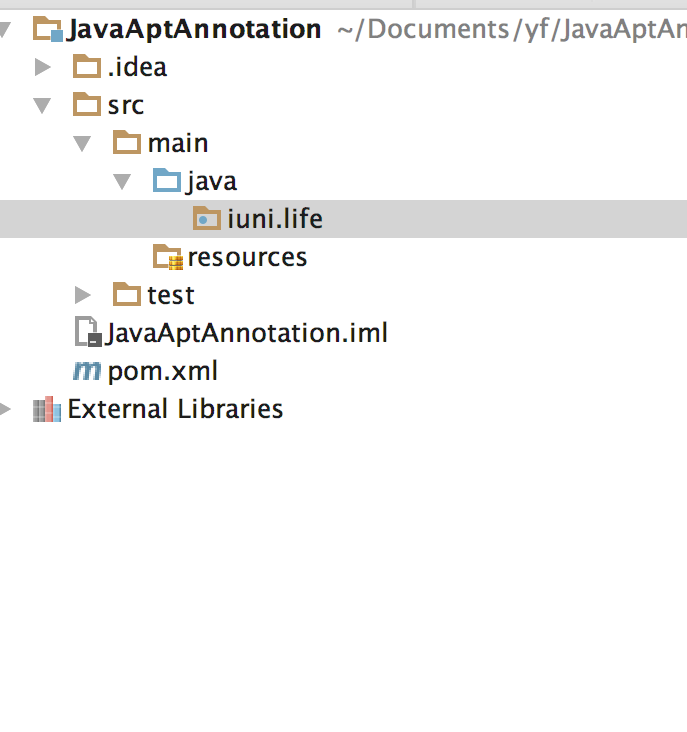

2.    **定义一个名为AptAnnotation的注解，其中如果@Target 和@Retention不了解的可以去 [Java注解一](http://iuni.life/2016/08/30/Java%E6%B3%A8%E8%A7%A3%E4%B8%80/) 进行了解**

      ```java
                  package iuni.life;

                  import java.lang.annotation.ElementType;
                  import java.lang.annotation.Retention;
                  import java.lang.annotation.RetentionPolicy;
                  import java.lang.annotation.Target;

                                   /**
      * Created by  iuni.life on 16/8/30.
      * yangfei's computer
      */
      @Target({ElementType.TYPE, ElementType.METHOD, ElementType.FIELD})
      @Retention(RetentionPolicy.SOURCE)
      public @interface AptAnnotation {
         String author() default "iuni.life";

         String date();

         int version() default 1;
      }
      ```

      ​

3.    **继承AbstractProcessor，实现process**

      * 新建一个AptAnnotationProcessor.class并继承自AbstractProcessor，可能会出现"Usage of API documented as @since 1.6+" 这个错误，出现这个错误就要修改语言等级，语言等级修改成1.6以上就可以了，我们修改成1.7（因为是在Android studio测试，而Android studio中支持Java8的jack编译器并不支持apt插件），如下是修改流程:    

        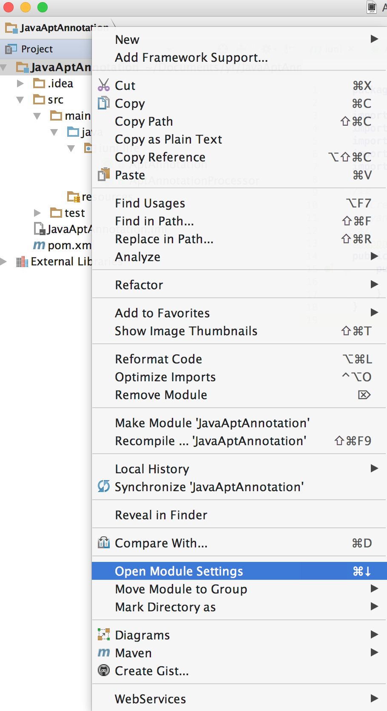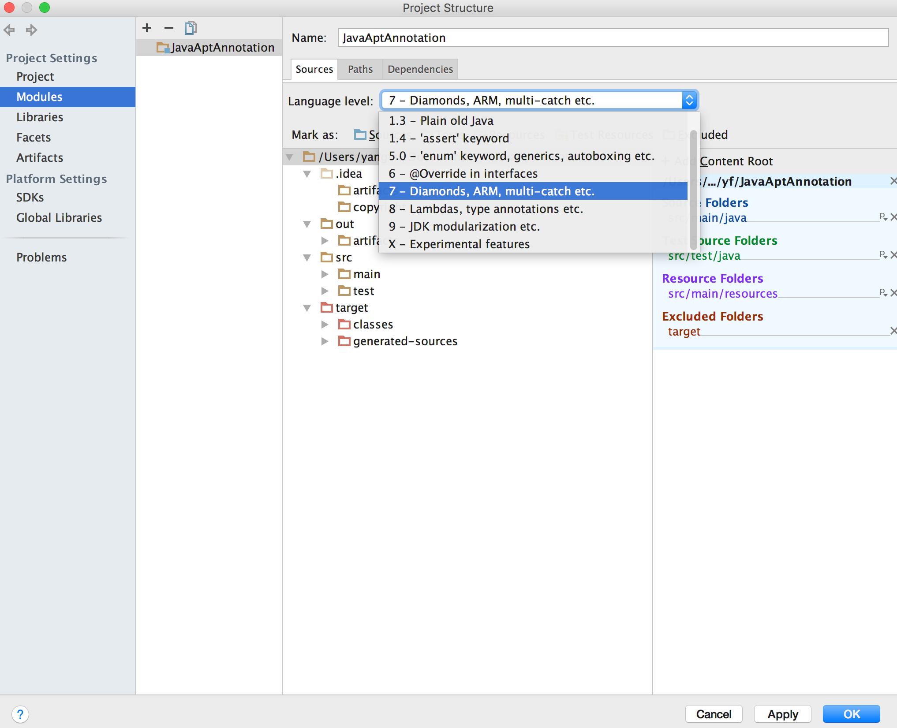

        点击Apply,OK 即可。

      * 至此，我们可以放心的写我们的代码了，下面是注解处理代码：

        ```java
        package iuni.life;

        import javax.annotation.processing.*;
        import javax.lang.model.SourceVersion;
        import javax.lang.model.element.Element;
        import javax.lang.model.element.PackageElement;
        import javax.lang.model.element.TypeElement;
        import javax.tools.Diagnostic;
        import javax.tools.JavaFileObject;
        import java.io.IOException;
        import java.io.PrintWriter;
        import java.io.Writer;
        import java.util.Set;

        /**
        * Created by  iuni.life on 16/8/30.
        * yangfei's computer
        */
        //支持的注解类型,此处要填写全名
        @SupportedAnnotationTypes("iuni.life.AptAnnotation")
        ////支持的JDk版本,我用的是1.7
        @SupportedSourceVersion(SourceVersion.RELEASE_7)
        public class AptAnnotationProcessor extends AbstractProcessor {

           //类名的前缀、后缀
           public static final String SUFFIX = "AutoGenerate";
           public static final String PREFIX = "My_";
         public boolean process(Set<? extends TypeElement> annotations, RoundEnvironment roundEnv) {
                 for (TypeElement typeElement : annotations) {
                     for (Element e : roundEnv.getElementsAnnotatedWith(typeElement)) {
                         //准备在gradle的控制台打印信息
                         Messager messager = processingEnv.getMessager();
                         //打印
                         messager.printMessage(Diagnostic.Kind.NOTE, "Printing:" + e.toString());
                         messager.printMessage(Diagnostic.Kind.NOTE, "Printing:" + e.getSimpleName());
                         messager.printMessage(Diagnostic.Kind.NOTE, "Printing:" + e.getEnclosedElements().toString());

                         //获取注解
                         AptAnnotation annotation = e.getAnnotation(AptAnnotation.class);

                         //获取元素名并将其首字母大写
                         String name = e.getSimpleName().toString();
                         char c = Character.toUpperCase(name.charAt(0));
                         name = String.valueOf(c + name.substring(1));

                         //包裹注解元素的元素, 也就是其父元素, 比如注解了成员变量或者成员函数, 其上层就是该类
                         Element enclosingElement = e.getEnclosingElement();
                         //获取父元素的全类名,用来生成报名
                         String enclosingQualifiedname;
                         if (enclosingElement instanceof PackageElement) {
                             enclosingQualifiedname = ((PackageElement) enclosingElement).getQualifiedName().toString();
                         } else {
                             enclosingQualifiedname = ((TypeElement) enclosingElement).getQualifiedName().toString();
                         }
                         try {
                             //生成包名
                             String generatePackageName = enclosingQualifiedname.substring(0, enclosingQualifiedname.lastIndexOf("."));

                             // 生成的类名
                             String genarateClassName = PREFIX + enclosingElement.getSimpleName() + SUFFIX;

                             //创建Java 文件
                             JavaFileObject f = processingEnv.getFiler().createSourceFile(genarateClassName);

                             // 在控制台输出文件路径
                             messager.printMessage(Diagnostic.Kind.NOTE, "Printing: " + f.toUri());
                             Writer w = f.openWriter();
                             try {
                                 PrintWriter pw = new PrintWriter(w);
                                 pw.println("package " + generatePackageName + ";");
                                 pw.println("\npublic class " + genarateClassName + " { ");
                                 pw.println("\n    /** 打印值 */");
                                 pw.println("    public static void print" + name + "() {");
                                 pw.println("        // 注解的父元素: " + enclosingElement.toString());
                                 pw.println("        System.out.println(\"代码生成的路径: " + f.toUri() + "\");");
                                 pw.println("        System.out.println(\"注解的元素: " + e.toString() + "\");");
                                 pw.println("        System.out.println(\"注解的版本: " + annotation.version() + "\");");
                                 pw.println("        System.out.println(\"注解的作者: " + annotation.author() + "\");");
                                 pw.println("        System.out.println(\"注解的日期: " + annotation.date() + "\");");

                                 pw.println("    }");
                                 pw.println("}");
                                 pw.flush();
                             } finally {
                                 w.close();
                             }
                         } catch (IOException e1) {
                             processingEnv.getMessager().printMessage(Diagnostic.Kind.ERROR,
                                     e1.toString());
                         }
                     }
                 }
                 //该方法返回ture表示该注解已经被处理, 后续不会再有其他处理器处理; 返回false表示仍可被其他处理器处理.
                 return true;
             }
         }

        ```

      * **说明:**

         该段代码其实就是解析注解并获取需要的值，然后使用JavaFileObject生成相关的Java代码。

4.    **现在我们需要生成Jar文件，需要修改pom.xml,默认生成的pom.xml需要再添加jar，和maven-compiler-plugin,修改后如下所示：**

      ```xml
         <?xml version="1.0" encoding="UTF-8"?>
         <project xmlns="http://maven.apache.org/POM/4.0.0"
                  xmlns:xsi="http://www.w3.org/2001/XMLSchema-instance"
                  xsi:schemaLocation="http://maven.apache.org/POM/4.0.0 http://maven.apache.org/xsd/maven-4.0.0.xsd">
             <modelVersion>4.0.0</modelVersion>

             <groupId>iuni.life</groupId>
             <artifactId>iuni</artifactId>
             <version>1.0-SNAPSHOT</version>
             <packaging>jar</packaging>
             <build>
                 <plugins>
                     <plugin>
                         <artifactId>maven-compiler-plugin</artifactId>
                         <version>2.3.2</version>
                         <configuration>
                             <source>1.6</source>
                             <target>1.6</target>
                             <!-- Disable annotation processing for ourselves. -->
                             <compilerArgument>-proc:none</compilerArgument>
                         </configuration>
                     </plugin>
                 </plugins>
             </build>

         </project>
      ```

      ​

5.    **打成jar文件步骤如下图流程所示:**

      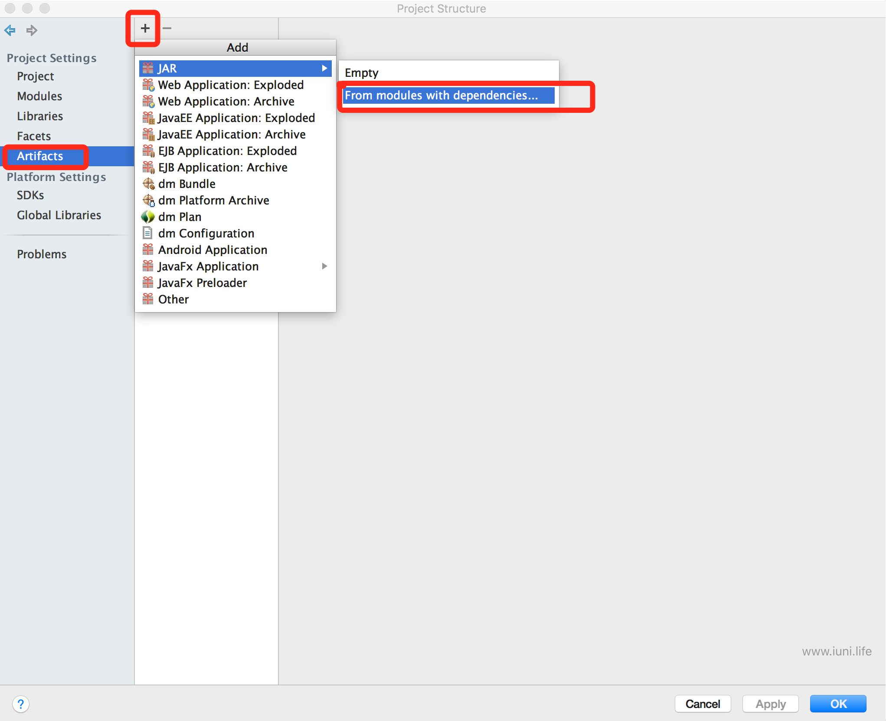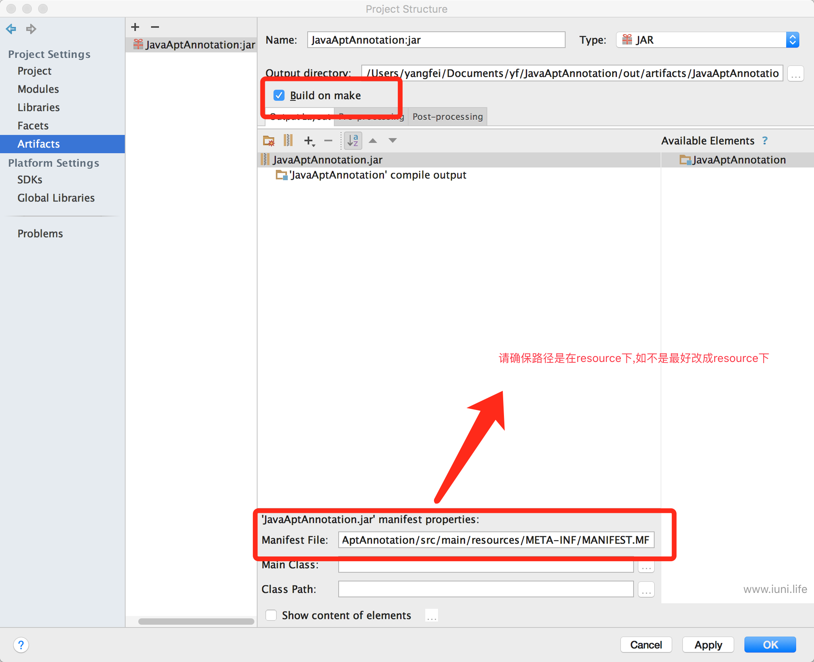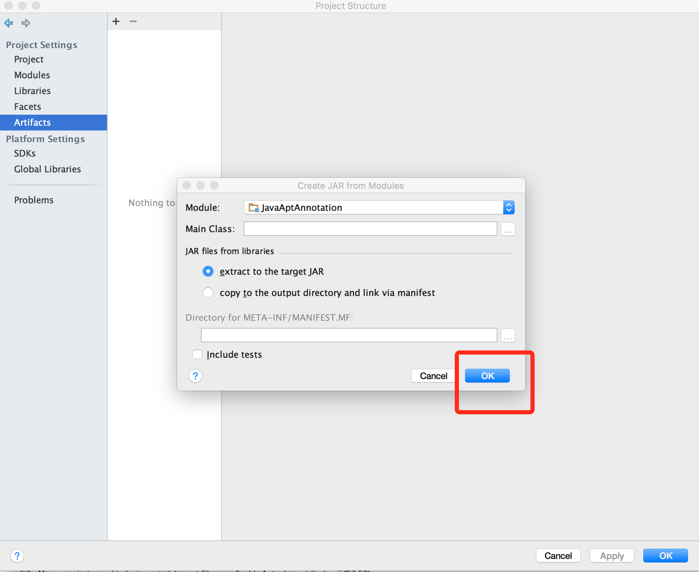

         目前为止，项目目录应该是下图所示：

      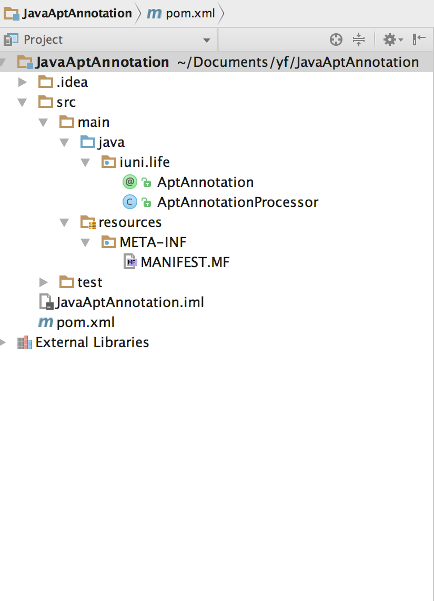

6.    **在resources资源文件夹下新建META-INF/services/javax.annotation.processing.Processor文件，在META-INF中显示标识，以便AptAnnotationProcessor被使用,**(其中services需要自己新建Directory)

      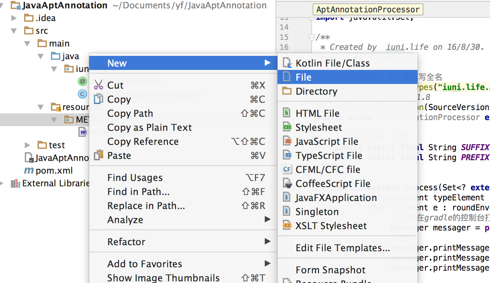

       目前为止，项目目录应该是这样：

      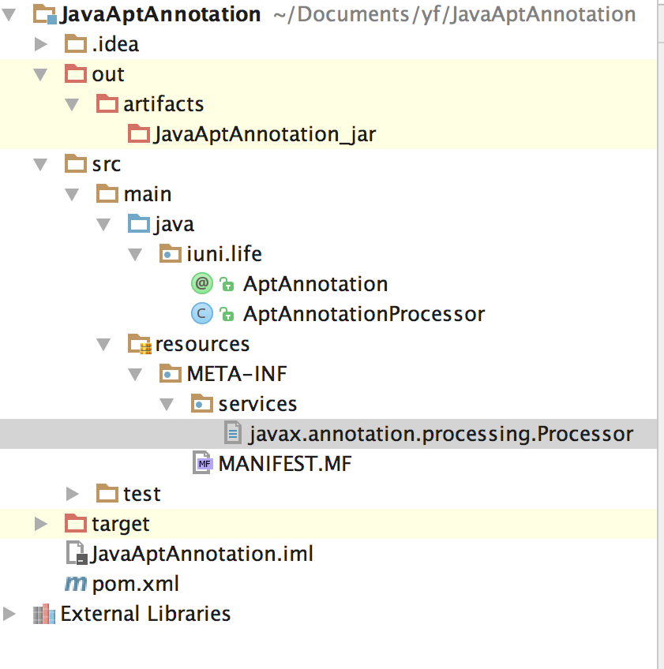

        在javax.annotation.processing.Processor中写入我们的AptAnnotationProcessor完整名称：“iuni.life.AptAnnotationProcessor”，如下图：

      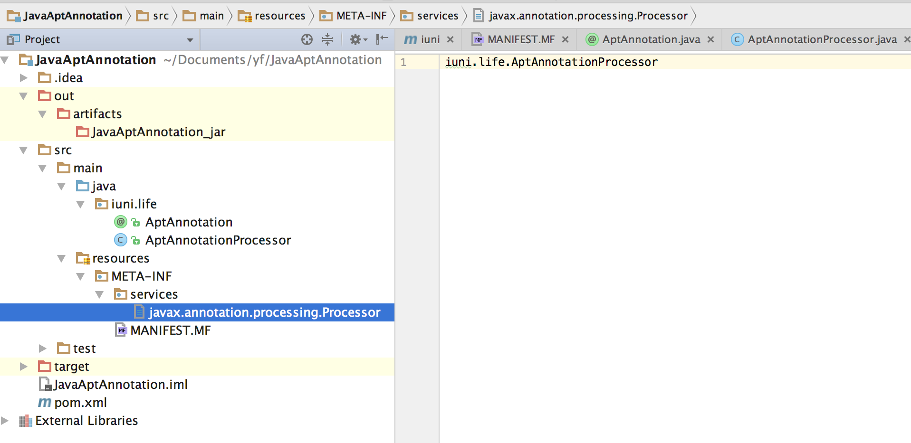

7.    **执行“Make Project”**

      * 执行过程中如出现“**Error:java: Compilation failed: internal java compiler error**”这个错误，则需要去修改项目的JDK版本,详见下图:

        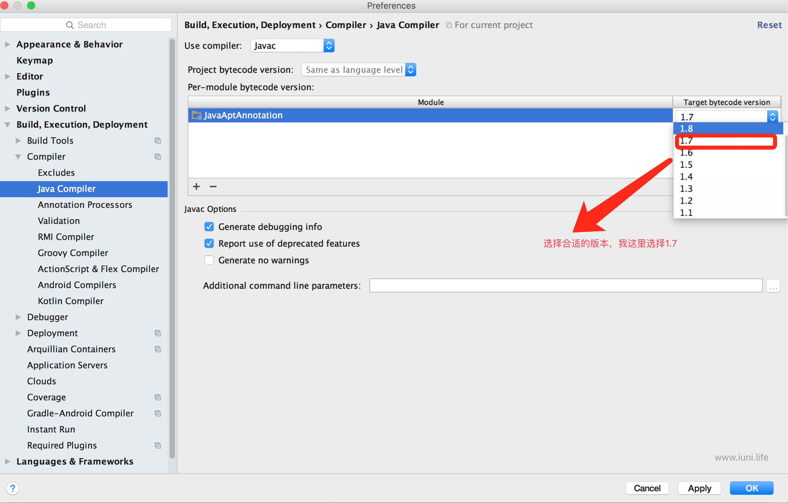

      * 若出现”javax.annotation.processing.Processor: Provider me.generator.GenerateInterfaceProcessor not found“这个异常，则需要将javax.annotation.processing.Processor文件中的内容删掉，然后make两次，然后在加入原来的内容，然后在make。

8.    **生成jar文件**

      在执行步骤7无错误的情况下会在如下的文件目录下生成jar包：

      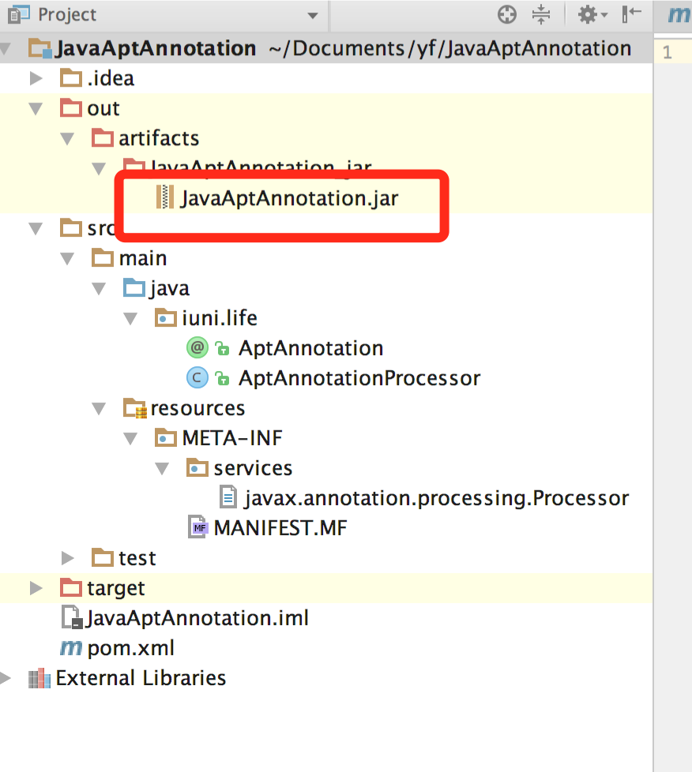


# 使用Android Studio验证生成的jar包

1. 使用android Studio新建一个测试项目，把生成的JavaAptAnnotation.jar拷贝到测试项目的libs,并add as library至该测试项目。

2. 为使用注解，需要对测试项目的gradle 进行如下配置:

   * 项目根目录gradle中build.gradle的dependencies添加：“classpath 'com.neenbedankt.gradle.plugins:android-apt:1.8' ”

   * 执行完上述步骤之后的build.gradle如下图所示：

     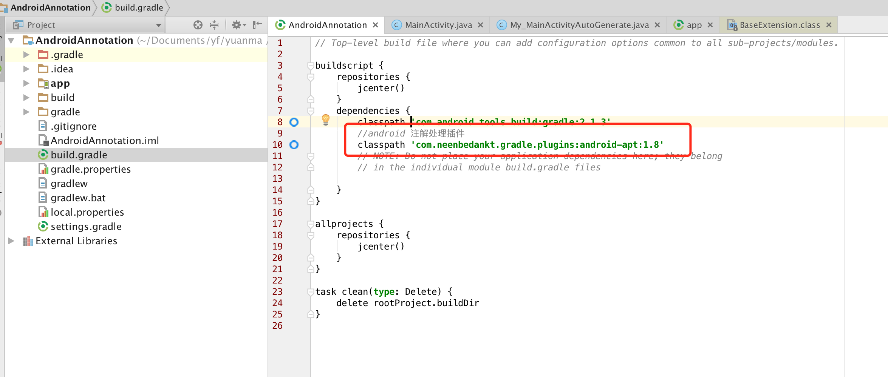

3. 同样也要对Moudle的build.gradle进行配置

   * 首先引入Android-apt 插件，即在Moudle的build.gradle加入：

     * apply plugin: 'android-apt'

   * 执行完上述步骤之后的Moudle的build.gradle如下图所示：

     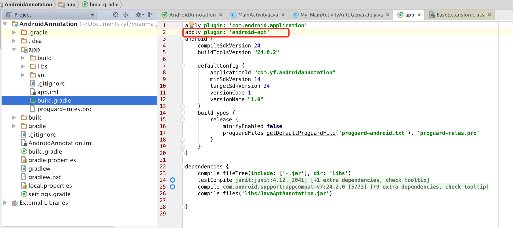

4. 编写测试，我们只做一个简单的测试，在MainActivity中使用我们自己定义的注解，如下：

   ```java
   package com.yf.androidannotation;

   import android.support.v7.app.AppCompatActivity;
   import android.os.Bundle;

   import iuni.life.AptAnnotation;

   public class MainActivity extends AppCompatActivity {

       @Override
       protected void onCreate(Bundle savedInstanceState) {
           super.onCreate(savedInstanceState);
           setContentView(R.layout.activity_main);
           test();
       }
       @AptAnnotation(author = "iuni",date = "2016-08-31",version = 1)
       public void test(){}
   }

   ```

5. make Project当前项目，会在如下图找到生成的java文件：

   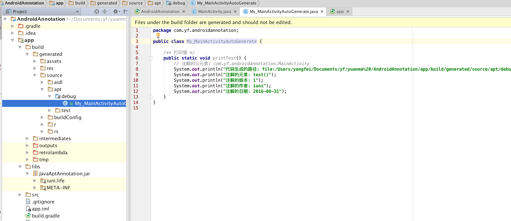

6. 这时我们就可以使用生成的文件了

   ```java
   package com.yf.androidannotation;

   import android.support.v7.app.AppCompatActivity;
   import android.os.Bundle;

   import com.yf.androidannotation.My_MainActivityAutoGenerate;

   import iuni.life.AptAnnotation;

   public class MainActivity extends AppCompatActivity {

       @Override
       protected void onCreate(Bundle savedInstanceState) {
           super.onCreate(savedInstanceState);
           setContentView(R.layout.activity_main);
           test();
       }
       @AptAnnotation(author = "iuni",date = "2016-08-31",version = 1)
       public void test(){
           My_MainActivityAutoGenerate.printTest();
       }
   }

   ```

7. 运行测试,在LogCat中会出现如下图所示：

    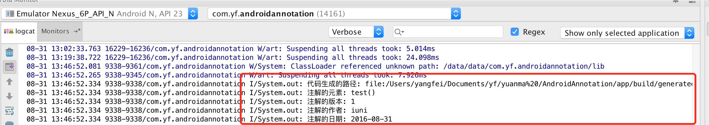


​    


